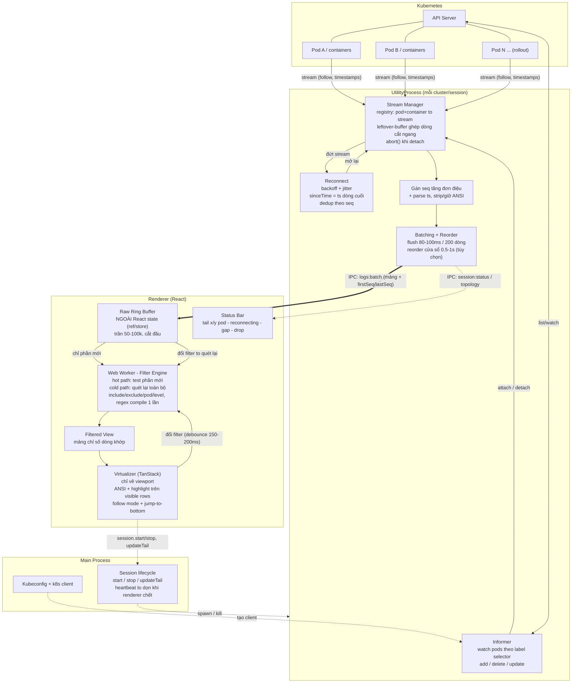

# Thiết kế: Multi-Pod Log Viewer (Electron + React)

> Spec kỹ thuật cho tính năng tail log đa pod của một Deployment, filter/grep realtime, highlight — mục tiêu vượt Log viewer của Lens về cả quy mô lẫn tính năng.
>
> Stack: Electron (main + utilityProcess) · React (renderer) · `@kubernetes/client-node`.

---

## Mục lục

1. [Nguyên tắc & bất biến cốt lõi](#1-nguyên-tắc--bất-biến-cốt-lõi)
2. [Topology process](#2-topology-process)
3. [Sơ đồ luồng dữ liệu](#3-sơ-đồ-luồng-dữ-liệu)
4. [Layer streaming (informer + stream manager + reconnect)](#4-layer-streaming-informer--stream-manager--reconnect)
5. [Batching + Reorder](#5-batching--reorder)
6. [IPC contract](#6-ipc-contract)
7. [Renderer state + Virtualized render](#7-renderer-state--virtualized-render)
8. [Ngân sách hiệu năng & tham số mặc định](#8-ngân-sách-hiệu-năng--tham-số-mặc-định)
9. [Danh sách bẫy dễ chết](#9-danh-sách-bẫy-dễ-chết)
10. [Thứ tự triển khai đề xuất](#10-thứ-tự-triển-khai-đề-xuất)

---

## 1. Nguyên tắc & bất biến cốt lõi

Toàn bộ hệ khóa chặt bởi **năm bất biến**. Sai một trong năm là vỡ ở cluster lớn:

1. **Reconciler (desired vs actual)** ở layer streaming — informer sinh trạng thái mong muốn, stream manager kéo trạng thái thực về khớp; không xử lý imperative theo từng event.
2. **Snapshot-không-delta** ở IPC status — status/topology mô tả trạng thái hiện tại (gửi lại được, idempotent), không phải delta tích lũy. Lỡ một message vẫn tự phục hồi.
3. **Seq tách khỏi ts** ở batching — `seq` là thứ tự *đến* (dedup/gap/React key), `ts` là thứ tự *sự kiện* (hiển thị/reorder). Không được lẫn.
4. **Log sống ngoài React, khóa theo seq** ở renderer — dữ liệu log không nằm trong React state; ring buffer khóa theo seq (không dùng index mảng).
5. **Worker sở hữu việc filter** — filter chạy trong Web Worker giữ bản buffer riêng; main thread chỉ lo vẽ.

Bốn quyết định kiến trúc nền: **streaming ở utility process**, **buffer sống ngoài React**, **filter trong worker**, **render virtualized**.

---

## 2. Topology process

Ba tầng, tách bạch trách nhiệm:

- **Main process** — giữ kubeconfig, tạo k8s client, quản lý vòng đời session, gác cổng mọi lệnh điều khiển, dọn dẹp khi renderer chết.
- **UtilityProcess (mỗi cluster/session)** — chạy informer + stream manager + reconnect + batching. Tách khỏi main để một cluster lỗi nặng/ngốn CPU không làm đơ UI và không đơ cluster khác.
- **Renderer (React)** — nhận batch đã gắn nhãn, giữ buffer hiển thị, vẽ virtualized.

Nguyên tắc: renderer **không bao giờ** nói trực tiếp với API server; mọi việc nặng (parse, sort cửa sổ, gom batch) đẩy về utility process. Renderer chỉ còn hai việc tốn sức: **filter** (đẩy tiếp sang Worker) và **render** (virtualized).

---

## 3. Sơ đồ luồng dữ liệu

- Nét đứt (`-.->`) = luồng **điều khiển**, đi xuống. Renderer ra lệnh qua main; không chạm API server.
- Nét đậm (`==>`) = luồng **log** chính, đi lên. Đường nóng nhất, mọi tối ưu nằm ở đây.
- Ba vòng khép kín: informer ↔ API server; stream manager ↔ reconnect; virtualizer → worker → filtered view → virtualizer.



---

## 4. Layer streaming (informer + stream manager + reconnect)

Phần rủi ro nhất. Cốt lõi: **mô hình reconciler giống chính k8s** — informer tạo "desired", stream manager liên tục kéo "actual" về khớp.

### 4.1 Mô hình reconciler (desired vs actual)

- **Desired stream set**: tập tuple `(pod, container)` *đáng lẽ đang tail* — dẫn xuất từ cache pod của informer, sau khi lọc theo trạng thái container.
- **Actual stream set**: tập stream *đang thực sự mở* — stream manager giữ.
- **Reconcile loop** idempotent, làm ba việc lặp lại: mở stream thiếu; đóng stream thừa; để yên phần đã khớp.

Không react trực tiếp vào từng add/delete vì cách đó giòn (bỏ lỡ event → lệch vĩnh viễn; stream khi container chưa Ready → lỗi). Informer/pod-status chỉ là **trigger** gọi reconcile.

### 4.2 Informer

- Dùng `makeInformer` (list + watch theo `labelSelector` của deployment).
- **resourceVersion & relist**: informer tự quản, tự relist khi `410 Gone`. Nhưng nó *có thể phát `error` và ngừng* → bắt `error`, **restart với backoff + jitter**. Có `connect` event để biết đã (re)sync.
- **Resync**: sau relist phát lại `add` cho toàn bộ cache → reconciler idempotent bắt buộc để `add` lặp không mở stream trùng.
- **Nghe cả `update`**: thứ quyết định "tail được chưa" là trạng thái container trong `pod.status` (đổi qua update: `ContainerCreating` → `Running`), không qua add/delete.
- **Cache là nguồn desired**: mỗi event chỉ đánh dấu "cần reconcile" (debounce ngắn để gộp burst lúc rollout), rồi loop tính lại desired từ toàn bộ cache.

### 4.3 Dẫn xuất desired stream set (nhiều bẫy nhất)

- **Liệt kê container đúng**: `containers`, `initContainers`, `ephemeralContainers`. Mặc định tail container thường; cho tùy chọn init (log khởi động) + sidecar. Đừng giả định một container.
- **Gating theo container state** (mấu chốt): chỉ đưa `(pod, container)` vào desired khi state là `running` (hoặc `terminated` nếu user muốn xem log đã chết). `waiting` (`ContainerCreating`, `PodInitializing`, crash-loop giữa hai lần restart) thì **chưa** — stream lúc này trả 400/404. Khi chuyển `running`, update → reconcile → stream tự mở. Đây là cơ chế "tự bám pod mới khi rollout".
- **`previous`**: log của instance vừa chết (`previous: true`) không stream được, chỉ đọc một lần. Tách khái niệm: "live stream" vs "snapshot previous". Đừng nhét previous vào đường reconnect của live.
- **Key**: `namespace/podName/containerName` — **không** kèm restartCount/UID trong key chính. Nhưng lưu UID/restartCount trong metadata để phát hiện "pod cùng tên nhưng instance khác" (StatefulSet tái tạo pod trùng tên).

### 4.4 Stream manager

- **Registry**: `key → StreamHandle`. Handle gồm: abort controller, leftover-buffer, ts dòng cuối, state, backoff hiện tại.
- **Leftover buffer**: chunk HTTP không trùng ranh giới dòng — giữ phần dư sau `\n` cuối, ghép vào đầu chunk kế; chỉ emit dòng hoàn chỉnh; flush nốt khi EOF.
- **Parse timestamp**: bật `timestamps: true` → prefix RFC3339Nano. Tách ts ra khỏi nội dung tại utility, lưu ts number (cho reorder + `sinceTime`). Giữ dòng gốc nếu user muốn thấy ts.
- **Reconcile là điểm vào duy nhất để mở/đóng.** Không nơi nào khác tự mở stream — giữ actual luôn là hệ quả thuần của desired.

### 4.5 Reconnect

**Phân loại lỗi — phản ứng khác nhau:**

| Tình huống | Phản ứng |
|---|---|
| EOF bình thường (container terminated gọn) | `ended`, **không** reconnect (nếu restart, reconcile tự mở lại) |
| Connection reset / timeout / idle-close | reconnect thật → backoff |
| 400 / container not ready | gate ở desired tự xử; không hammer |
| 404 (pod biến mất) | để informer xóa cache → reconcile đóng |
| 401/403 (auth) | **không** retry vô hạn — surface lên UI, dừng |
| 429 (rate limit) | backoff mạnh hơn |

- **Backoff + jitter**: lũy thừa (0.5s → 1s → 2s → … trần ~30s) + jitter. Jitter chống thundering herd khi rollout làm chục stream đứt cùng lúc.
- **`sinceTime` + dedup (bắt buộc)**: `sinceTime` = ts dòng cuối để không nạp lại từ đầu. NHƯNG `sinceTime` chỉ có **độ phân giải giây** → mọi dòng cùng giây bị trả lại → **trùng dòng là chắc chắn**. Phải dedup: giữ fingerprint (ts nano + hash nội dung) của vài trăm dòng cuối mỗi container; trùng thì bỏ. Đây là lý do #1 khiến tool nghiệp dư "reconnect xong log nhân đôi".
- **Phân biệt `ended` vs `reconnecting`** cho UX — đẩy lên status bar, đừng gộp.

### 4.6 Seq & backpressure (xuyên suốt)

- **Seq đơn điệu**: cấp cho mọi dòng của *cả session* (không per-stream) ngay khi emit. Phục vụ: React key ổn định, dedup reconnect, phát hiện gap. Là thứ tự *đến*, không phải thời gian sự kiện.
- **Backpressure**: nếu renderer không kịp, buffer utility phình → OOM. Hai chiến lược (chuyển được): **pause** đọc HTTP (TCP backpressure về server; risk idle-close) hoặc **drop dòng cũ + gap marker** (giữ realtime; mặc định cho live tail).

### 4.7 State machine mỗi stream

```
idle → connecting → streaming → (disconnected → backoff → connecting)* → ended
```

Nhánh: `connecting → error-fatal` (401/403) → dừng hẳn; teardown bất kỳ đâu → `aborting → closed`. `disconnected` phân biệt retryable hay không để đi `backoff` hay `ended`/`error-fatal`. Informer có state machine riêng: `syncing → synced → (error → restarting → syncing)`.

### 4.8 Teardown & rò rỉ

Mỗi session sở hữu: 1 informer + N stream + reconcile loop + các timer backoff. Khi `session.stop`/tắt: abort mọi request, **clear mọi timer** (bẫy: timer backoff đang chờ vẫn nổ và mở lại stream sau khi đã đóng), dừng informer, xóa registry. Main phải kill utility khi renderer chết bất thường (heartbeat) — nếu không stream chạy ngầm ăn quota API server.

### 4.9 Thứ tự khởi động session

1. Nhận `session.start` → resolve `spec.selector.matchLabels`.
2. seq = 0, registry rỗng, batch buffer.
3. Start informer (list trước để có cache đầy đủ rồi mới watch).
4. Sau sync đầu → reconcile lần một → mở stream cho container đã `running`.
5. Mọi event / container-state change → đánh dấu dirty → reconcile (debounced).
6. Stream đứt → phân loại → backoff/reconnect hoặc để reconciler xử, kèm dedup.

---

## 5. Batching + Reorder

Tầng giữa stream manager và IPC — **điểm điều tiết áp suất duy nhất** giữa K8s và renderer.

### 5.1 Thứ tự thao tác

```
stream emit dòng hoàn chỉnh → gán seq → (reorder buffer) → batch accumulator → flush qua IPC
```

**Seq gán TRƯỚC reorder, reorder sắp theo ts** → sau reorder, seq trong một batch có thể không tăng đều (chủ ý). Renderer hiển thị theo **thứ tự đã emit sau reorder**; seq chỉ dùng nội bộ (dedup/gap/key), **không** sort lại theo seq ở renderer (nếu không phá công reorder).

### 5.2 Batch accumulator — flush hai điều kiện

Flush khi cái nào tới trước:
- **Ngưỡng số dòng** (~200): chặn kích thước batch (lúc bão log, độ trễ tự nhỏ).
- **Ngưỡng thời gian** (~80–100ms): chặn độ trễ (lúc nhỏ giọt vẫn đẩy đi).

*Adaptive (tùy chọn):* throughput cao → nới thời gian (~150ms) để batch to, giảm số lần IPC. Bắt đầu bằng hằng số, thêm adaptive nếu đo thấy IPC là nút thắt.

### 5.3 Reorder buffer — cửa sổ trượt theo thời gian

- **Cơ chế**: giữ dòng trong `reorderWindowMs` (500ms–1s), sort theo ts; chỉ "chín" (emit) dòng có `ts < now - windowMs`.
- **Độ rộng cửa sổ**: ngắn quá → vô dụng; dài quá → trễ hiển thị. Cho user chỉnh + **tắt hẳn** (window=0).
- **Mốc "now"**: dùng **wall clock** của utility, không dùng ts của dòng — miễn nhiễm clock skew của pod (pod gửi ts tương lai sẽ không chặn cả cửa sổ).
- **Dòng đến muộn quá cửa sổ**: emit-với-cờ-late (khuyên) hơn là drop — mất dòng tệ hơn lệch chỗ.

### 5.4 Clock skew (giới hạn vật lý)

Pod lệch giờ nhau vài giây (NTP không hoàn hảo) → reorder theo ts tuyệt đối giữa các pod **không bao giờ chính xác tuyệt đối**. Đừng hứa "global ordering hoàn hảo". Cân nhắc: trong 1 pod tin ts (đồng hồ nhất quán nội bộ); giữa các pod chấp nhận xấp xỉ.

### 5.5 Backpressure — điểm hợp lưu

Thực thi tại đây vì thấy cả tốc độ vào (stream) lẫn ra (renderer tiêu). Tín hiệu "renderer tụt": renderer báo highwater (số dòng tồn trong ring buffer). Hai chế độ:
- **pause**: ngừng đọc HTTP → TCP backpressure về server. **Không** tính là lỗi cần backoff (phối hợp reconnect layer).
- **drop**: bỏ dòng cũ nhất + **gap marker**. Mặc định cho live tail. Trường `dropped` trong batch cộng dồn tại đây.

### 5.6 Tương tác lifecycle

- **Previous snapshot** đi đường riêng, **không** qua reorder/batch (ts quá khứ xa sẽ phá mốc "now").
- Stream **abort/ended**: flush nốt dòng còn kẹt trong reorder buffer rồi mới gỡ (không mất dòng cuối).
- Dedup chính ở stream layer; nếu sót, seq đơn điệu là lớp phòng thứ hai ở renderer.

---

## 6. IPC contract

Ranh giới phải đóng băng sớm (hai phía code song song).

### 6.1 Nguyên tắc

- **Ba chiều, ba loại**: điều khiển đi xuống (renderer → main → utility); dữ liệu + trạng thái đi lên (main trung chuyển). Renderer không nói trực tiếp với utility.
- **Mọi message có `v` (version) + `type`** (discriminated union).
- **Data path tách kênh khỏi control**: `logs:batch` nóng, một chiều, không ack; control thưa, cần ack.
- **Mọi message gắn `sessionId`**.

### 6.2 Ba loại ID

- **`sessionId`**: một phiên tail (một panel). Main cấp khi start.
- **`streamKey`**: `namespace/podName/containerName`.
- **`requestId`**: cho lệnh control cần phản hồi (correlation ack).

`seq` không phải ID định danh — là số thứ tự dòng, nằm trong LogLine.

### 6.3 Control path (renderer → main → utility)

- **`session.start`**: `requestId`, `cluster`, `namespace`, `workload` (kind + name — để `kind` sẵn cho StatefulSet/DaemonSet sau), `opts` { `containers`, `tailLines` (~500), `timestamps`, `backpressureMode` (pause/drop), `reorderWindowMs` (0 = tắt) }. Ack: `sessionId` hoặc lỗi resolve.
- **`session.stop`**: `requestId` + `sessionId`. Ack sau khi teardown xong (renderer đợi ack mới coi panel đóng sạch).
- **`session.updateTail`**: đổi `tailLines` runtime.
- **`stream.setEnabled`**: bật/tắt tail một `streamKey` — lớp override chồng lên desired tự động; pod bị user tắt thì reconciler bỏ khỏi actual dù informer thấy running.
- **`stream.showPrevious`**: request một-lần snapshot `previous`, trả qua message riêng.
- **`session.setBackpressureMode`**: đổi pause/drop runtime.

### 6.4 Data path (utility → renderer)

**`logs:batch`** (kênh nóng):
- `sessionId`, `lines` (luôn mảng), `firstSeq`/`lastSeq` (phát hiện gap: `firstSeq > prevLastSeq + 1`), `dropped` (số dòng chủ động drop trước batch này).

**`LogLine`** (cố định sớm — chảy nhiều nhất):
- `seq`: number đơn điệu (React key + mốc dedup).
- `pod` + `container`: **tách sẵn** (khỏi parse string mỗi dòng).
- `ts`: number đã parse (reorder + hiển thị).
- `message`: đã **tách prefix ts**, **giữ nguyên ANSI** (parse màu là việc renderer trên visible rows).
- `level` (tùy chọn): làm ở utility thì đồng nhất, renderer nhẹ hơn.
- **Không** lặp `cluster`/`namespace` trong từng dòng — đặt ở envelope/session metadata (mỗi byte × throughput).

**`logs:previous`**: `sessionId`, `streamKey`, `lines`, `truncated`. Tách hẳn khỏi live.

### 6.5 Status path (utility → renderer)

- **`session:topology`** (gửi khi tập stream đổi, debounced): mảng entry mỗi `streamKey` gồm `pod`, `container`, `containerType`, `state` (connecting/streaming/reconnecting/ended/error-fatal), `enabledByUser`, `podUid`+`restartCount`. Nguồn để UI vẽ "tail 5/6 pod" + checkbox.
- **`session:status`**: biến cố cấp session — informer `syncing`/`synced`/`restarting`; fatal (401/403 dừng hẳn); rate-limit (429). Tách khỏi topology (topology ồn, status cần chú ý).
- **Nguyên tắc**: status/topology là **snapshot idempotent**, không delta — miss một message thì message kế vẫn cho bức tranh đầy đủ.

### 6.6 Handshake vòng đời

1. Renderer `session.start` (requestId).
2. Main spawn utility (nếu chưa có cho cluster đó), forward.
3. Utility resolve selector → lỗi thì ack lỗi ngay.
4. Start informer, chờ sync → `session:status: synced`.
5. Reconcile đầu → `session:topology` đầu → `logs:batch` chảy.
6. Renderer coi "ready" khi có ack start + topology đầu.

**Dọn**: main theo dõi heartbeat (ping/pong hoặc `webContents` destroyed); renderer chết → stop mọi session + kill utility.

### 6.7 Serialization & kênh Electron

IPC structured clone không rẻ ở throughput cao. Lựa chọn (chốt **hình dạng** sớm vì ăn vào LogLine schema):
- **Object thuần**: dễ debug, đủ tốt phần lớn tải. Bắt đầu ở đây.
- **Columnar** (mảng song song `seq[]`, `ts[]`, `pod[]`, `message[]`): giảm overhead object, trường lặp nén tốt.
- **MessagePort** trực tiếp utility↔renderer cho kênh nóng (bỏ một lần copy qua main); control vẫn qua main. Đổi được sau nếu giữ payload y nguyên.

### 6.8 Lỗi & version

- **Lỗi có `code` (enum)** + `message` + `retryable`: `SELECTOR_EMPTY`, `WORKLOAD_NOT_FOUND`, `FORBIDDEN`, `UNAUTHORIZED`, `RATE_LIMITED`, `INFORMER_FAILED`...
- **`v: 1`** mọi envelope. Thêm trường chỉ optional; phá vỡ thì tăng `v`, negotiate lúc handshake.

---

## 7. Renderer state + Virtualized render

Nguyên tắc gốc: **log không sống trong React state.** React là lớp vẽ mỏng, đọc từ store ngoài, chỉ render phần nhìn thấy.

### 7.1 Ba lớp state

- **Lớp 1 — Raw ring buffer (nguồn sự thật)**: ngoài React, trần 50k–100k, cắt đầu. Dùng **ring buffer thật** (mảng vòng + head/tail), **không** `array.shift()` (O(n), giật ở throughput cao). Ghi khi batch tới; không trigger re-render trực tiếp.
- **Lớp 2 — Filtered view (phái sinh)**: **không copy dòng** — chỉ giữ danh sách chỉ số/tham chiếu. Đổi filter → tính lại; batch mới → chỉ test phần mới rồi append.
- **Lớp 3 — React state (tối thiểu)**: chỉ thứ nhỏ, đổi thưa — filter hiện tại, follow on/off, danh sách pod + trạng thái, đếm dòng mới, cấu hình hiển thị. **Không** để nội dung/số lượng dòng ở đây.
- **Cầu nối**: `useSyncExternalStore` (hoặc store lib). React subscribe vào **version number của filtered view** (số nguyên tăng mỗi khi view đổi); render thì đọc slice hiện tại.

### 7.2 Đường đi của batch (hot path)

1. Ghi dòng vào ring buffer (cập nhật head; tràn thì dời tail + điều chỉnh offset).
2. Phát hiện gap (so `firstSeq`/`lastSeq` lần trước) → chèn gap-marker.
3. Đẩy phần mới sang Worker test filter (đường nóng).
4. Worker trả tập khớp → append chỉ số vào filtered view → tăng version.
5. Follow mode → scroll đáy; không thì tăng đếm "dòng mới".

**Chốt**: không quét lại toàn bộ buffer mỗi batch — chi phí tỉ lệ *số dòng mới*, không phải tổng buffer.

### 7.3 Ranh giới ring buffer ↔ chỉ số

Khi cắt đầu, chỉ số cũ lệch. **Dùng seq làm khóa tuyệt đối** (không index mảng): view giữ seq; lookup seq → vị trí hiện tại qua offset (seq nhỏ nhất còn giữ); cắt đầu chỉ dời offset, seq rơi khỏi buffer thì lọc khỏi view. React key = seq (ổn định qua cắt đầu).

### 7.4 Filter trong Worker

- **Worker giữ bản ring buffer riêng** (nhận mọi batch song song với main) → đường lạnh (quét lại) chạy hoàn toàn trong worker, main không gửi cả buffer sang. Main chỉ gửi "filter mới", worker quét bản của nó, trả danh sách seq khớp.
- **Đường nóng** (batch mới): test phần mới.
- **Đường lạnh** (đổi filter): quét lại toàn bộ — debounce input 150–200ms; regex compile một lần khi filter đổi.
- Mô hình filter: `include (text/regex) AND NOT exclude AND (pod set) AND (level set)`, cho nhiều include kiểu OR (mức stern/Lens không có).
- *SharedArrayBuffer* (đọc không copy) chỉ lên khi đo thấy copy là nút thắt (cần cross-origin isolation).

### 7.5 Virtualized render (TanStack Virtual)

- **Chiều cao dòng**: **no-wrap mặc định** (fixed-height, scroll ngang, virtualizer tính vị trí bằng phép nhân — nhanh nhất). **wrap** tùy chọn (dynamic measurement, cache theo seq — chậm hơn).
- **Follow / tail mode**: auto-scroll đáy; **tự tắt khi user cuộn lên** (nút "jump to bottom" + đếm dòng mới); bật lại khi về đáy. Cắt đầu *trong lúc* xem lịch sử → neo scroll theo **seq** (không pixel tuyệt đối) để màn hình không nhảy.
- **Highlight chỉ trên visible rows**: ANSI (anser) parse trong render của row (không precompute cả buffer); highlight search term; level tô nền/chữ; prefix màu theo hash tên pod.
- **Chi phí mỗi row cực rẻ**: component thuần, memo hóa, không tạo object/closure mới mỗi render.

### 7.6 Tương tác với contract

- **Gap marker** (mất IPC) + **dropped marker** (backpressure): render thành hàng đặc biệt ("⋯ N dòng bị lược ⋯"), màu phân biệt.
- **Topology** → panel bên cạnh: danh sách pod + trạng thái + checkbox (`stream.setEnabled`). Đổi thưa → React state bình thường.
- **Previous snapshot** → vùng riêng (modal/tab), không trộn live.
- **Status lỗi** (401/403, 429) → banner, không nhét vào luồng log.

### 7.7 Đa session

Mỗi panel = một session = một bộ (ring buffer + worker + filtered view) riêng. Không chia sẻ buffer. Mỗi session một worker (cô lập lỗi, tận dụng core) — ổn với số panel thực tế.

---

## 8. Ngân sách hiệu năng & tham số mặc định

**Mục tiêu nghiệm thu:**
- Chịu ~20 pod, ~20k dòng/giây tổng.
- Buffer đầy 100k dòng vẫn scroll 60fps (virtualization + fixed height).
- Gõ filter không giật khi buffer đầy (worker + debounce).
- Batch 20k dòng/giây không rớt frame (hot path chỉ chạm phần mới + không re-render toàn list).
- RAM phẳng theo thời gian (ring buffer cắt đầu, không rò).

**Tham số mặc định (cấu hình runtime, không hardcode):**

| Tham số | Mặc định | Ghi chú |
|---|---|---|
| Flush batch | 80ms **hoặc** 200 dòng | cái nào tới trước |
| Reorder window | 0 (tắt) | bật 500ms nếu interleave khó chịu |
| Backpressure mode | drop + gap marker | live tail |
| Ngưỡng drop | ring buffer ~80% trần | renderer báo highwater |
| Ring buffer trần | 50k–100k dòng | bảo vệ RAM |
| tailLines ban đầu | ~500 / container | |
| Backoff reconnect | 0.5s → 30s, có jitter | lũy thừa |
| Debounce filter input | 150–200ms | |

---

## 9. Danh sách bẫy dễ chết

Xếp theo mức độ hay sai:

1. **Dedup khi reconnect** — `sinceTime` chỉ có độ phân giải giây → trùng dòng chắc chắn. Bắt buộc fingerprint dedup. (#1 gây "log nhân đôi".)
2. **Gating theo container state** — stream khi container chưa `running` sẽ lỗi 400/404.
3. **Hủy timer backoff lúc teardown** — timer đang chờ vẫn nổ, mở lại stream sau khi đã đóng (rò stream ngầm).
4. **Buffer trong React state** — đẩy chục nghìn dòng qua re-render = tự sát. Phải để ngoài React.
5. **Index mảng làm React key** — vỡ khi cắt đầu ring buffer. Dùng seq.
6. **Sort lại theo seq ở renderer** — phá công reorder. Hiển thị theo thứ tự đã emit.
7. **Reorder dùng ts của dòng làm mốc "now"** — clock skew của pod chặn cả cửa sổ. Dùng wall clock.
8. **Lặp cluster/namespace trong từng LogLine** — mỗi byte × throughput. Đặt ở envelope.
9. **Leftover buffer bỏ qua** — chunk cắt ngang dòng → log vỡ/dính dòng.
10. **`array.shift()` cho ring buffer** — O(n), giật. Dùng mảng vòng.
11. **Precompute ANSI/highlight cho cả buffer** — chỉ làm trên visible rows.
12. **Không kill utility khi renderer chết** — stream chạy ngầm ăn quota API server (cần heartbeat).

---

## 10. Thứ tự triển khai đề xuất

Dựng theo rủi ro giảm dần — phần dưới phụ thuộc phần trên:

1. **Streaming layer** (informer + reconciler + stream manager + reconnect + dedup) — rủi ro nhất, mọi thứ phụ thuộc. Test bằng cluster thật với rollout + crash-loop.
2. **Batching + reorder + backpressure** — ngay trên streaming.
3. **IPC contract** — đóng băng schema (LogLine, message types) trước khi renderer code song song.
4. **Renderer state** (ring buffer + worker filter + filtered view) — không cần UI đẹp, test bằng số liệu.
5. **Virtualized render + highlight + follow mode** — lớp vẽ cuối.
6. **Status/topology UI + previous snapshot + đa session** — hoàn thiện UX.

---

*Hết spec. Năm bất biến xuyên suốt: reconciler (desired/actual) · snapshot-không-delta · seq tách khỏi ts · log-ngoài-React khóa-theo-seq · worker-sở-hữu-filter.*