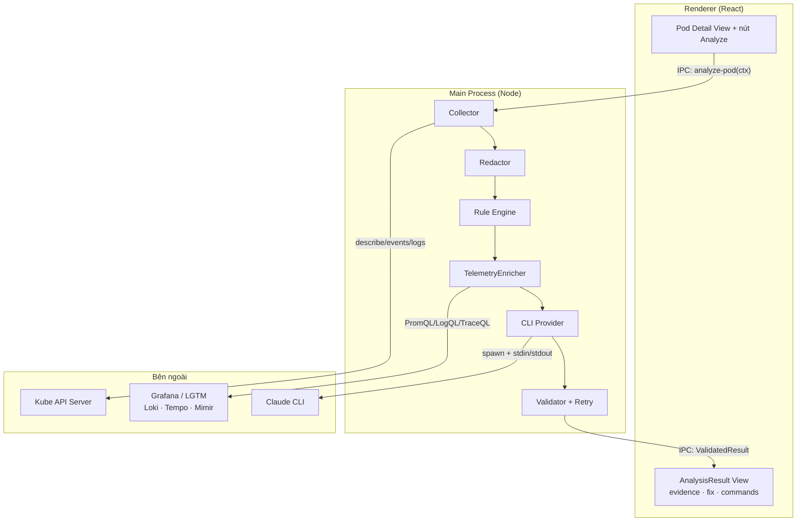
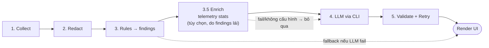
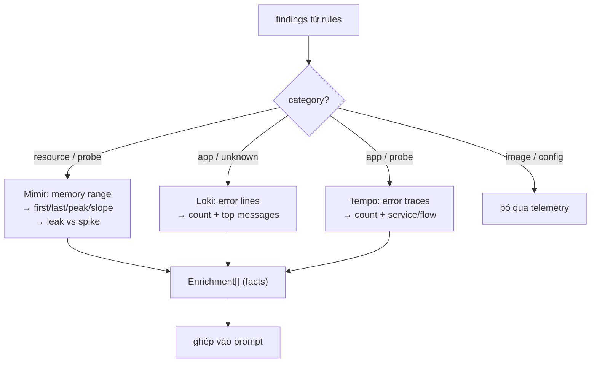
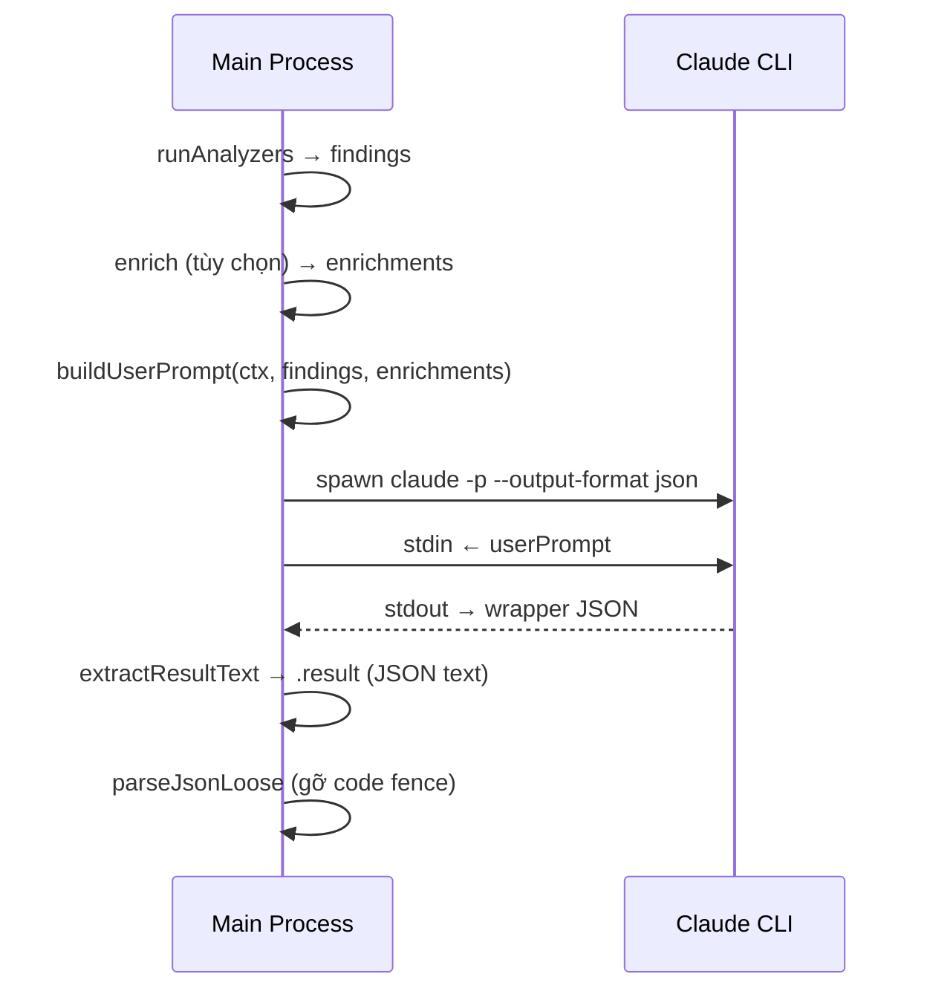
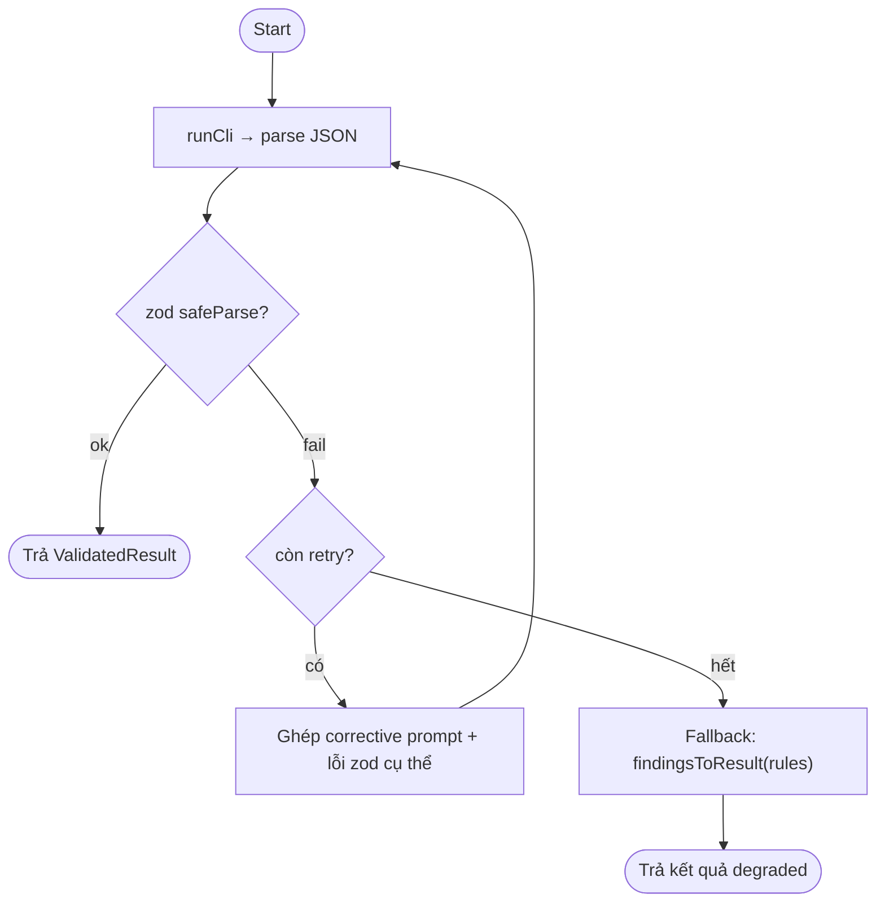

# Thiết kế: AI Troubleshooting cho Pod CrashLoopBackOff

> Spec kỹ thuật cho tính năng AI troubleshooting (kiểu k8sgpt) trong app quản lý Kubernetes — React + Electron. Khi phát hiện pod `CrashLoopBackOff`, hệ thống tự thu thập events + logs + describe, chạy rule engine, enrich bằng telemetry LGTM (tùy chọn), rồi dùng Claude CLI (headless, không cần API key) để giải thích nguyên nhân gốc và đề xuất fix.

**Phiên bản:** 0.3 · **Cập nhật:** 2026-07-24 · **Trạng thái:** Draft

---

## Mục lục

1. [Mục tiêu & phạm vi](#1-mục-tiêu--phạm-vi)
2. [Nguyên tắc thiết kế](#2-nguyên-tắc-thiết-kế)
3. [Kiến trúc tổng thể](#3-kiến-trúc-tổng-thể)
4. [Pipeline phân tích](#4-pipeline-phân-tích)
5. [Bước 1 — Thu thập dữ liệu](#5-bước-1--thu-thập-dữ-liệu)
6. [Bước 2 — Redact secret](#6-bước-2--redact-secret)
7. [Bước 3 — Rule engine](#7-bước-3--rule-engine)
8. [Bước 3.5 — Enrichment: Telemetry LGTM (tùy chọn)](#8-bước-35--enrichment-telemetry-lgtm-tùy-chọn)
9. [Bước 4 — LLM qua CLI (headless)](#9-bước-4--llm-qua-cli-headless)
10. [Prompt & Schema](#10-prompt--schema)
11. [Bước 5 — Validate & Retry](#11-bước-5--validate--retry)
12. [UI/UX (Renderer)](#12-uiux-renderer)
13. [Cấu trúc module](#13-cấu-trúc-module)
14. [Bảo mật & vận hành](#14-bảo-mật--vận-hành)
15. [Mở rộng tương lai](#15-mở-rộng-tương-lai)
16. [Phụ lục — Bảng tra exit code](#16-phụ-lục--bảng-tra-exit-code)

---

## 1. Mục tiêu & phạm vi

Mục tiêu là rút ngắn thời gian chẩn đoán pod `CrashLoopBackOff` từ "đọc thủ công describe + logs + events" xuống một cú click. Hệ thống tự gom bối cảnh, phân loại nguyên nhân, và đưa ra fix cụ thể có thể review trước khi áp dụng.

Trong phạm vi phiên bản đầu: tập trung vào `CrashLoopBackOff` và các trạng thái liên quan trực tiếp (`ImagePullBackOff`, `CreateContainerConfigError`, OOMKilled, probe fail). Ngoài phạm vi: phân tích toàn cluster, cost optimization, security scanning, và tự động apply fix (chỉ gợi ý, người dùng tự chạy).

Ràng buộc nền tảng: Electron (main + renderer), React ở renderer, `@kubernetes/client-node` cho k8s API, và Claude CLI ở chế độ headless làm engine suy luận thay cho việc quản lý API key trực tiếp. Nếu có Grafana + LGTM (Loki/Tempo/Mimir), hệ thống dùng thêm telemetry làm tầng enrichment tùy chọn.

## 2. Nguyên tắc thiết kế

Thiết kế xoay quanh năm nguyên tắc. **Rules-first** — logic xác định chạy trước, LLM chỉ là tầng giải thích chứ không phải tầng quyết định duy nhất; nhờ vậy hệ thống vẫn hoạt động khi không có LLM. **Redact-before-egress** — mọi secret bị mask trước khi rời máy người dùng. **Evidence-based** — mọi kết luận phải trích dẫn nguyên văn log/event/field hoặc số liệu telemetry, giảm hallucination. **Review-not-apply** — hệ thống chỉ đưa lệnh, không tự thay đổi cluster. **Provider-agnostic** — engine suy luận (Claude CLI, hay CLI khác) và nguồn telemetry được trừu tượng hóa sau interface, đổi provider chỉ bằng config.

Một hệ quả quan trọng: telemetry cũng tuân theo rules-first — không đổ time series thô vào LLM mà trích **stats dẫn xuất** (slope, peak, error rate) rồi mới đưa vào prompt.

## 3. Kiến trúc tổng thể

Toàn bộ truy cập k8s API, telemetry query, và gọi CLI đặt ở **main process** để giữ kubeconfig + service account token + phiên đăng nhập CLI khỏi renderer, tránh CORS, và tránh lộ thông tin nhạy cảm ra tầng UI. Renderer (React) chỉ nhận dữ liệu đã xử lý qua IPC.



## 4. Pipeline phân tích

Luồng gồm sáu bước (một bước enrichment tùy chọn). Điểm mấu chốt là **không đẩy thẳng dữ liệu thô vào LLM**: có redact, rule engine, và enrichment trích stats ở giữa.



Lý do có các bước giữa collect và LLM: redact là bắt buộc về bảo mật; rule engine bắt case xác định 100% mà không tốn phiên CLI; enrichment bổ sung chiều thời gian và xuyên-replica mà snapshot k8s thiếu.

## 5. Bước 1 — Thu thập dữ liệu

Kích hoạt khi phát hiện container ở trạng thái crash — đọc `pod.status.containerStatuses[].state.waiting.reason === "CrashLoopBackOff"` hoặc `lastState.terminated.exitCode != 0`. Collector (main process, `@kubernetes/client-node`) gom bốn nguồn:

Đầu tiên là **describe/spec + status**: resource limits/requests, probes (liveness/readiness/startup), env, volumeMounts, `restartCount`, và đặc biệt `lastState.terminated` chứa exit code + reason + `finishedAt`. Thứ hai là **events** — `coreV1.listNamespacedEvent` lọc theo `involvedObject.uid` của pod, sort theo `lastTimestamp`. Thứ ba là **logs**: lấy cả current lẫn `previous: true`; với CrashLoop thì log của container **đã chết** (previous) mới chứa nguyên nhân thật, nên đây là nguồn quan trọng nhất — chỉ lấy `tailLines` (~200–500) để kiểm soát token. Cuối cùng là **related resources**: owner (Deployment/ReplicaSet), các ConfigMap/Secret được reference, ServiceAccount.

Kết quả được chuẩn hóa thành object `AnalysisContext` (xem [Cấu trúc module](#13-cấu-trúc-module)). Trường `finishedAt` đặc biệt quan trọng vì nó là mốc để khoanh cửa sổ query telemetry ở bước 3.5.

## 6. Bước 2 — Redact secret

Trước khi context rời main process để vào telemetry/CLI/LLM, mọi giá trị nhạy cảm phải được mask. Áp dụng cho: env values, `data` trong Secret, connection string, token, password, và các pattern bí mật phổ biến (JWT, API key, `Authorization:` header trong log). Tên biến/tên resource giữ nguyên để còn suy luận; chỉ **giá trị** bị thay bằng placeholder như `***REDACTED***`.

Redact đặt ở collector, ngay sau khi dựng context và **trước** mọi lời gọi ra ngoài. `buildUserPrompt` giả định context đã sạch.

## 7. Bước 3 — Rule engine

Mỗi analyzer là một hàm thuần `(ctx) => Finding[]`. `runAnalyzers` chạy toàn bộ, gom kết quả, sort theo confidence giảm dần. Đây là kết quả cơ bản khi không có LLM; khi có LLM, findings được đưa vào prompt như gợi ý ban đầu để LLM xác nhận/tinh chỉnh. Findings cũng **lái** quyết định query telemetry ở bước sau.

| Analyzer | Tín hiệu bắt | Category | Confidence |
|---|---|---|---|
| `oom-killed` | exit 137 / signal 9 / reason `OOMKilled` | resource | high |
| `image-pull` | waiting `ImagePullBackOff` / `ErrImagePull` | image | high |
| `config-error` | event `CreateContainerConfigError` / `FailedMount`; missingRefs | config | high/medium |
| `exit-code` | exit 127 / 126 / 128+n / 1–2 (app error) | app/config | high/medium |
| `liveness-probe` | restartCount cao + event `Unhealthy` + initialDelay ngắn | probe | high/medium |
| `log-signal` | log previous chứa `panic\|fatal\|exception\|refused...` | app | low |

## 8. Bước 3.5 — Enrichment: Telemetry LGTM (tùy chọn)

Đây là tầng bổ sung chèn giữa rules và LLM, giải quyết điểm yếu lớn nhất của snapshot k8s: nó chỉ thấy **một** thời điểm và **một** instance đã chết gần nhất. LGTM cung cấp chiều thời gian và góc nhìn xuyên nhiều replica.

Mỗi nguồn mạnh ở một lớp lỗi khác nhau:

| Nguồn | Bù được gì | Lái bởi finding category |
|---|---|---|
| **Mimir** (metrics) | Đường cong memory/CPU trước lúc kill — phân biệt *leak từ từ* vs *spike*, right-size limit theo peak thật | `resource`, `probe` |
| **Loki** (logs) | Log tất cả restart + mọi replica, history dài hơn kubectl, log ngay trước cửa sổ crash | `app`, `unknown` |
| **Tempo** (traces) | Request chết ở đâu trong flow — dependency timeout, DB refused, downstream 5xx | `app`, `probe` |

Ba ràng buộc thiết kế bắt buộc để enrichment không phản tác dụng. Thứ nhất, **không dump raw telemetry vào LLM** — query bằng PromQL/LogQL/TraceQL rồi trích stats dẫn xuất (slope memory, peak, error count, top message, số trace lỗi); đưa *con số*, không đưa chuỗi. Thứ hai, **fetch có điều kiện do findings lái** — nghi `resource/OOM` mới query Mimir; `app` mới query Loki+Tempo; image pull thì bỏ qua telemetry. Thứ ba, **correlation theo thời điểm crash** — dùng `finishedAt` để khoanh cửa sổ `[finishedAt - 15m, finishedAt]`; sai window là ra dữ liệu vô nghĩa.



Về triển khai: query qua Grafana datasource proxy (`/api/datasources/proxy/uid/{uid}/...`), service account token gửi dạng `Bearer` và giữ ở main process. Mỗi query có timeout riêng và lỗi được nuốt cục bộ — một datasource fail không kéo sập cả pipeline. Nếu telemetry chưa cấu hình, `enrich()` trả `[]` và luồng degrade về đúng như không có telemetry. Interface `TelemetryEnricher` cho phép thay `GrafanaEnricher` bằng nguồn khác (Prometheus trực tiếp, Datadog...) mà không đổi logic.

Ví dụ giá trị định lượng: rule engine nói "OOMKilled, high" — đúng nhưng cụt. Có Mimir, LLM nâng thành *"memory tăng ~40Mi/phút suốt 3h tới limit 512Mi → leak, không phải spike; tăng limit chỉ trì hoãn"* — kèm số cụ thể trong evidence.

## 9. Bước 4 — LLM qua CLI (headless)

Thay vì quản lý API key, hệ thống shell-out Claude CLI ở chế độ headless — giống hệt cách shell-out `az cli`: spawn subprocess, đẩy prompt qua stdin, đọc stdout. CLI dùng luôn phiên đăng nhập sẵn có của người dùng.

Lệnh cốt lõi: `claude -p --output-format json --append-system-prompt <SYSTEM> --allowedTools ""`. Trong đó `-p` là headless (chạy một lần rồi thoát); `--output-format json` cho stdout dạng wrapper JSON; `--append-system-prompt` gắn persona SRE; và `--allowedTools ""` **tắt tool** — quan trọng, để CLI chỉ suy luận ra text thay vì chạy như agent tự gọi kubectl.



**Parse hai lớp**: `--output-format json` trả wrapper `{ result, session_id, total_cost_usd, ... }`; field `.result` là text model sinh ra, mà text đó lại là JSON theo schema của mình. Nên bóc lớp ngoài (`extractResultText`) rồi bóc lớp trong (`parseJsonLoose`, có gỡ code fence ` ```json ` nếu model bọc).

**Provider-agnostic**: khai một `CliProviderConfig` (`command`, `buildArgs`, `extractResultText`) cho mỗi CLI. Ngoài `claude`, hệ thống hỗ trợ **Antigravity/Gemini** qua binary `agy`; nếu `agy` chưa có trên máy (CLI chưa cập nhật), tự động fallback lần lượt sang `antigravity` rồi `gemini`. Việc chọn binary do `resolveCliCommand` xử lý dựa trên danh sách `command + fallbacks` trong config, còn logic spawn/parse giữ nguyên. Có biến thể streaming dùng `--output-format stream-json`.

## 10. Prompt & Schema

**System prompt** đặt persona SRE Kubernetes với các ràng buộc: chỉ kết luận từ dữ liệu được cấp; nếu thiếu thì nói rõ và hạ confidence; mỗi kết luận kèm evidence trích dẫn nguyên văn; coi rule findings là gợi ý để xác nhận/bác bỏ; **coi telemetry facts là số liệu đo được đáng tin và trích dẫn số cụ thể vào evidence**; fix phải cụ thể và cảnh báo rủi ro; không tự apply; trả về duy nhất một object JSON.

**Structured output** dùng schema (`ANALYSIS_SCHEMA`), tương thích cả Anthropic tool-use lẫn OpenAI `response_format`. Các field: `rootCause`, `confidence` (enum), `category` (enum), `evidence[]` (min 1), `fixSteps[]` (min 1), `commands[]?`, `risk?`, `missingData[]?`.

**Builder** (`buildUserPrompt(ctx, findings, enrichments?)`) serialize gọn: containers, resources, probes, 15 events mới nhất, log previous full ~60 dòng và current ~30, danh sách rule findings, và khối telemetry facts.

## 11. Bước 5 — Validate & Retry

CLI chỉ sinh text (không ép schema như tool-use API), nên kết quả có thể thiếu field, sai enum, hoặc kèm rác. Lớp validate dùng **zod** (`AnalysisResultSchema` khớp 1-1 với `ANALYSIS_SCHEMA`): parse → `safeParse` → nếu fail thì gọi lại CLI với **corrective prompt** chứa chính lỗi zod cụ thể (field nào thiếu, enum nào sai), tối đa N lần (mặc định 2, tổng 3 lần chạy).



Corrective prompt dùng lỗi thật thay vì "trả lại JSON đi" — LLM sửa trúng hơn. **Graceful degradation**: `analyzeValidatedSafe` không throw; hết retry thì fallback về `findingsToResult(findings)` (kết quả rule engine, luôn có sẵn) kèm cờ `degraded`. Cả `analyzeValidated` và `analyzeValidatedSafe` trả về kèm `enrichments` để UI hiển thị nguồn telemetry đã dùng.

## 12. UI/UX (Renderer)

Nút "Analyze with AI" đặt ngay trên pod detail view. Kết quả render gồm: root cause + badge confidence, khối **evidence** collapsible (highlight đúng dòng log/event và số liệu telemetry), fix steps dạng markdown, và các `commands` mỗi lệnh có nút **Copy** / **Apply**. Với Apply phải hiện **diff YAML** và confirm trước khi patch — không bao giờ tự động apply. Hiển thị các `enrichments` (vd chart memory từ Mimir) như bằng chứng trực quan. Nếu `degraded === true`, hiển thị nhãn "kết quả rule-based (LLM không khả dụng)". Trạng thái streaming (nếu dùng `stream-json`) render token dần.

### 12.1. Cấu hình AI Troubleshooting riêng biệt (`manage-settings-section-ai`)

Giao diện Cài đặt ứng dụng (`#manage-settings-pane`) tách riêng phần **AI Troubleshooting & Diagnostics** thành một Section độc lập (id `manage-settings-section-ai`), thay vì lẫn vào cấu hình chung. Section này cho phép chọn **AI CLI Provider** (`claude` hoặc `agy`), **test kết nối CLI** qua hàm `testCli` (chạy thử binary đã resolve, báo phiên bản/trạng thái đăng nhập), và giữ sẵn cấu trúc để mở rộng các thiết lập nâng cao trong tương lai: custom system prompt, auto-troubleshoot khi phát hiện crash, và override API key/endpoint cho môi trường tự host.

Provider chọn ở đây được truyền xuống `CliProviderConfig` tương ứng (`CLAUDE_CLI` hoặc `AGY_CLI`) và dùng cho toàn bộ luồng phân tích. `testCli` tận dụng `resolveCliCommand` để xác nhận binary khả dụng trước khi lưu cài đặt, tránh lỗi runtime khi người dùng bấm Analyze.

## 13. Cấu trúc module

```
main/
  collector.ts      # k8s API → AnalysisContext (+ redact)
  redactor.ts       # mask secret/token/password
  analyzers.ts      # rule engine: runAnalyzers(ctx) → Finding[]
  telemetry.ts      # TelemetryEnricher + GrafanaEnricher (Mimir/Loki/Tempo)
  prompt.ts         # SYSTEM_PROMPT, ANALYSIS_SCHEMA, buildUserPrompt
  cliProvider.ts    # spawn claude -p; runCli, parseJsonLoose; provider config
  validate.ts       # zod schema + retry + graceful degradation + enricher
  types.ts          # AnalysisContext, Finding, Enrichment, AnalysisResult
  ipc.ts            # ipcMain.handle("analyze-pod", ...)
renderer/
  AnalyzeButton.tsx
  AnalysisResultView.tsx
```

Quan hệ phụ thuộc: `types` ← tất cả; `analyzers`/`prompt`/`telemetry` ← `types`; `cliProvider` ← `analyzers` + `prompt` + `types`; `validate` ← `cliProvider` + `analyzers` + `prompt` + `telemetry` + `types`. Renderer chỉ biết `types` (qua IPC).

`AnalysisContext` gồm: `namespace`, `podName`, `containers[]` (name, restartCount, waitingReason, exitCode, signal, terminatedReason, finishedAt), `events[]`, `probes[]`, `logsPrevious`, `logsCurrent`, `limits`, `requests`, `missingRefs[]`. `Finding`: `id`, `title`, `category`, `confidence`, `summary`, `evidence[]`, `suggestedFixes[]`, `commands[]?`. `Enrichment`: `source` (mimir/loki/tempo), `title`, `facts[]`, `raw?` (không gửi LLM).

Đầu vào của luồng: `analyzeValidatedSafe(ctx, { enricher: new GrafanaEnricher(telemetryCfg), maxRetries: 2 })`.

## 14. Bảo mật & vận hành

Redact là hàng phòng thủ đầu tiên và bắt buộc — kiểm thử riêng cho redactor. Đặt mọi lời gọi ra ngoài (k8s, telemetry, CLI) ở main process, không bao giờ ở renderer. Service account token của Grafana giữ ở main, gửi dạng `Bearer`, không log ra file. Tắt tool của CLI (`--allowedTools ""`). Đặt timeout cho subprocess (60s) và cho mỗi telemetry query (10s). Không log prompt/response chứa dữ liệu cluster ra log dài hạn. Với cluster nhạy cảm, cân nhắc CLI/model local qua `CliProviderConfig`.

Cân nhắc chi phí/độ trễ: enrichment thêm 1–3 HTTP query, nên chỉ chạy có điều kiện. Metric/label của Mimir và schema search của Tempo khác nhau giữa các cluster — để `TelemetryConfig` cho phép override query. Flag CLI (`stream-json`, tên field event) có thể đổi theo version — xác minh bằng `claude --help`.

## 15. Mở rộng tương lai

Thêm analyzer cho các trạng thái khác (`Pending`/`FailedScheduling`, `Evicted`, `Init` container fail). Cache kết quả theo `pod.uid + restartCount`. Cho phép "apply fix" an toàn qua dry-run + diff. Vẽ chart telemetry inline trong UI. Cho phép override PromQL/LogQL/TraceQL theo cluster. Thu thập phản hồi người dùng (fix có đúng không) để tinh chỉnh prompt.

## 16. Phụ lục — Bảng tra exit code

| Exit code | Ý nghĩa | Hướng xử lý |
|---|---|---|
| 0 | Thành công | — |
| 1–2 | App tự thoát với lỗi | Đọc `logsPrevious` + Loki tìm stack trace |
| 126 | File không execute được | `chmod +x`; kiểm tra arch (amd64/arm64) |
| 127 | Command/entrypoint không tìm thấy | Kiểm tra command/args + ENTRYPOINT |
| 128+n | Bị kill bởi signal n | Tra signal (137=SIGKILL/OOM, 143=SIGTERM, 139=SIGSEGV) |
| 137 | SIGKILL — thường là OOMKilled | Tăng memory limit; kiểm tra leak qua Mimir |

---

*Tài liệu này là spec tham chiếu khi code. Cập nhật khi thay đổi schema hoặc thêm analyzer.*