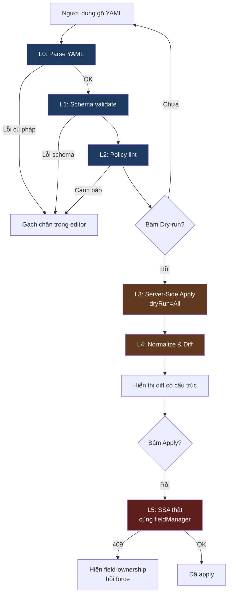
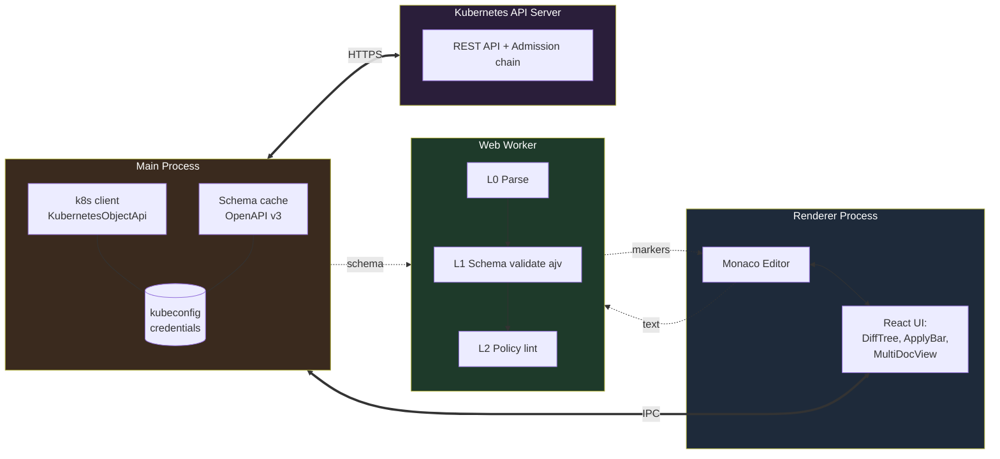
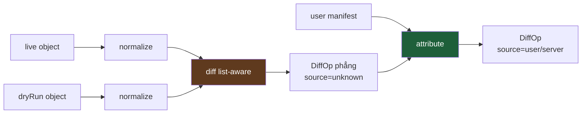
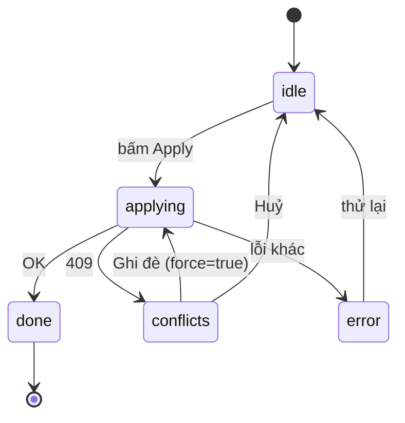
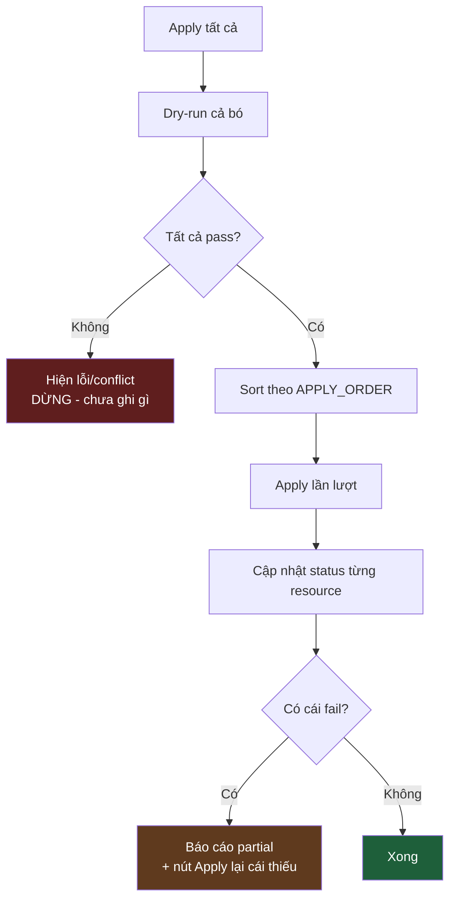
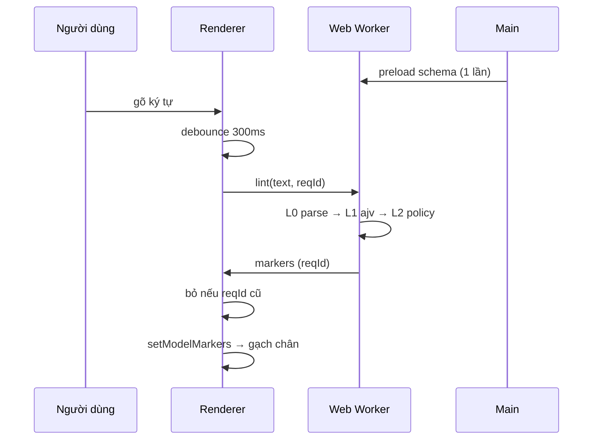
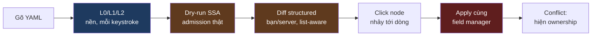

# Thiết kế: YAML Editor với Dry-run + Diff + Schema Validation

> **Bối cảnh:** Tính năng cốt lõi cho một công cụ quản lý Kubernetes (React + Electron), định vị "hơn Lens" ở khả năng validate nhiều tầng, diff có cấu trúc phân biệt nguồn thay đổi, và xử lý field-ownership khi apply.
>
> **Trạng thái:** Design spec — dùng làm tham chiếu khi code.
> **Client:** `@kubernetes/client-node` (native, không bundle kubectl).
> **Cập nhật:** 2026-07

---

## Mục lục

1. [Mục tiêu & phạm vi](#1-mục-tiêu--phạm-vi)
2. [Quyết định kiến trúc: Native vs Bundle kubectl](#2-quyết-định-kiến-trúc-native-vs-bundle-kubectl)
3. [Pipeline validate nhiều tầng (L0–L5)](#3-pipeline-validate-nhiều-tầng-l0l5)
4. [Kiến trúc process trong Electron](#4-kiến-trúc-process-trong-electron)
5. [L3 — Dry-run bằng Server-Side Apply](#5-l3--dry-run-bằng-server-side-apply)
6. [L4 — Normalize & Diff có cấu trúc](#6-l4--normalize--diff-có-cấu-trúc)
7. [Schema-backed list-type resolver](#7-schema-backed-list-type-resolver)
8. [Render layer — cây diff + Monaco](#8-render-layer--cây-diff--monaco)
9. [L5 — Apply thật & xử lý conflict](#9-l5--apply-thật--xử-lý-conflict)
10. [Position mapping — path ↔ dòng editor](#10-position-mapping--path--dòng-editor)
11. [Đa tài liệu (multi-doc `---`)](#11-đa-tài-liệu-multi-doc---)
12. [Pipeline lint L0–L2 trong Web Worker](#12-pipeline-lint-l0l2-trong-web-worker)
13. [Điểm khác biệt so với Lens](#13-điểm-khác-biệt-so-với-lens)
14. [Việc gia cố cho production (chưa làm)](#14-việc-gia-cố-cho-production-chưa-làm)
15. [Phụ lục — chữ ký hàm & bẫy đã biết](#15-phụ-lục--chữ-ký-hàm--bẫy-đã-biết)

---

## 1. Mục tiêu & phạm vi

Xây một editor YAML cho tài nguyên Kubernetes cho phép người dùng:

- Nhận **feedback tức thì** khi gõ (validate cú pháp, schema, policy) mà không giật UI.
- **Dry-run** qua admission chain thật của cluster trước khi apply.
- Xem **diff có cấu trúc** giữa trạng thái hiện tại và kết quả dry-run, phân biệt rõ *thay đổi của người dùng* với *mutation/defaulting của server*.
- **Apply** an toàn, hiển thị rõ conflict về field-ownership.
- Xử lý được **file nhiều resource** (`---`) với thứ tự apply đúng.

**Nguyên tắc thiết kế xuyên suốt:** validate không phải một bước mà là nhiều lớp có chi phí/độ trễ khác nhau. Tách rõ các lớp để cho feedback sớm nhất có thể ở mỗi mức chi phí.

---

## 2. Quyết định kiến trúc: Native vs Bundle kubectl

App cần "nói chuyện" với API server để dry-run/diff/apply. Hai hướng:

| | Bundle kubectl | **Native (đã chọn)** |
|---|---|---|
| Cách làm | Đóng gói binary `kubectl`, chạy ngầm như lệnh terminal, parse output | Gọi thẳng REST API qua `@kubernetes/client-node` |
| Công sức ban đầu | Thấp (kubectl lo merge/diff/SSA) | Cao (tự implement merge/diff) |
| Chất lượng UI | Kém — output text thô, parse bằng regex dễ vỡ | Tốt — object JSON có cấu trúc |
| Kích thước app | Nặng (binary × 3 nền tảng) | Nhẹ |
| Rắc rối version | Nhiều (kubectl phải khớp cluster) | Ít |
| Kiểm soát | Thấp | Cao |

**Kết luận:** đi **native**. Điểm "hơn Lens" nằm ở UI/UX diff đẹp và feedback rõ — mà text thô của kubectl chính là thứ giới hạn trải nghiệm. Đánh đổi (tự viết merge + diff) rơi đúng vào "phần lõi giá trị" của sản phẩm, nên công sức bỏ ra đúng chỗ.

> **Lối thoát:** không chọn cứng. Native là mặc định; nếu gặp ca merge quá hiểm mà tự làm chưa chuẩn, có thể fallback shell ra kubectl *chỉ cho riêng ca đó*.

---

## 3. Pipeline validate nhiều tầng (L0–L5)

Chạy từ rẻ→đắt, mỗi tầng cho feedback sớm hơn tầng sau:

| Tầng | Việc | Khi nào | Chi phí | Cần cluster? |
|---|---|---|---|---|
| **L0** | Parse YAML → object, báo lỗi cú pháp kèm dòng/cột | Mỗi keystroke (debounce) | Rẻ | Không |
| **L1** | Schema validation (kiểu kubeconform) từ GVK | ~300ms debounce | Rẻ | Không* |
| **L2** | Policy/lint (image `:latest`, thiếu limits, probe…) | Cùng L1 | Rẻ | Không |
| **L3** | Server dry-run qua admission chain thật | On-demand | Đắt | **Có** |
| **L4** | Diff kết quả L3 với object live | Sau L3 | Trung bình | — |
| **L5** | Apply (cùng field manager với L3) | On-demand | — | **Có** |

\* L1 dùng schema fetch sẵn từ cluster (xem §7); chạy offline được nếu đã cache.



**Ranh giới then chốt:** L0–L2 *không đụng cluster* → chạy nền mỗi keystroke trong Web Worker. L3+ *có đụng cluster* (chậm, tốn, cần auth, có thể trigger webhook) → giữ on-demand sau nút bấm.

---

## 4. Kiến trúc process trong Electron



**Phân vai:**

- **Renderer:** Monaco + React UI. Chỉ logic thuần và render.
- **Web Worker:** L0/L1/L2 — CPU thuần, không giật main thread dù schema lớn/file dài.
- **Main:** mọi call cluster (L3/L4/L5) + schema fetch/cache. Giữ credential (kubeconfig) — **không để trong renderer**.
- Nguyên tắc: **Main giữ I/O + credential, Worker giữ CPU thuần, Renderer giữ render.**

---

## 5. L3 — Dry-run bằng Server-Side Apply

### 5.1 Vì sao dùng `KubernetesObjectApi`

Để PATCH lên đúng endpoint SSA, URL có dạng:

```
/apis/{group}/{version}/namespaces/{ns}/{resource}/{name}
```

`{resource}` là **tên số nhiều viết thường** (`deployments`), **không phải** `Kind` (`Deployment`). Phải discovery để map `Kind → resource` và biết namespaced hay không. `KubernetesObjectApi` lo phần GVK→resource resolution đó → dùng nó thay vì tự dựng URL.

### 5.2 Setup client

```typescript
// main/k8s.ts
import * as k8s from '@kubernetes/client-node';

const FIELD_MANAGER = 'lens-vibe'; // cố định, PHẢI trùng giữa dry-run và apply thật

export function makeClient() {
  const kc = new k8s.KubeConfig();
  kc.loadFromDefault();
  return { kc, objApi: k8s.KubernetesObjectApi.makeApiClient(kc) };
}
```

### 5.3 Hàm dry-run + lấy object live

```typescript
import * as yaml from 'js-yaml';

export interface DryRunResult {
  dryRun: k8s.KubernetesObject;        // object sau khi server merge + default
  live: k8s.KubernetesObject | null;   // object đang chạy, null nếu chưa tồn tại
  conflicts?: any;
}

export async function dryRunApply(
  objApi: k8s.KubernetesObjectApi,
  manifestYaml: string,
): Promise<DryRunResult> {
  const spec = yaml.load(manifestYaml) as k8s.KubernetesObject;

  // 1. Lấy object live TRƯỚC (để diff). 404 → coi như tạo mới.
  let live: k8s.KubernetesObject | null = null;
  try {
    live = await objApi.read(spec as any);
  } catch (e: any) {
    if (e?.statusCode !== 404 && e?.response?.statusCode !== 404) throw e;
  }

  // 2. Server-Side Apply, dry-run.
  try {
    const dryRun = await objApi.patch(
      spec,
      undefined,          // pretty
      'All',              // dryRun → không ghi
      FIELD_MANAGER,      // fieldManager
      'Strict',           // fieldValidation → từ chối field lạ/gõ sai
      false,              // force
      { headers: { 'Content-Type': 'application/apply-patch+yaml' } },
    );
    return { dryRun, live };
  } catch (e: any) {
    if (e?.statusCode === 409 || e?.response?.statusCode === 409) {
      return { dryRun: spec, live, conflicts: e.body ?? e.response?.body };
    }
    throw e; // 422 = lỗi schema/validation → surface nguyên văn
  }
}
```

**Ý nghĩa các tham số quan trọng:**

- `Content-Type: application/apply-patch+yaml` — **bắt buộc** cho SSA.
- `dryRun='All'` — chạy qua toàn bộ admission chain (webhook, defaulting, quota) nhưng **không ghi**.
- `fieldValidation='Strict'` — server **từ chối** field lạ/gõ sai. Đây là một lớp validate miễn phí mà kubeconform tĩnh **không** làm được (nó không biết field nào lạ với version cụ thể).
- `force=false` — field bị manager khác own sẽ báo **conflict** thay vì cướp.

### 5.4 Kết quả

Với một manifest, thu được **hai object JSON**: `live` (đang chạy) và `dryRun` (server nói kết quả sẽ ra sao). Ba tình huống:

- `live === null` → tạo mới, diff toàn bộ.
- Có cả hai → update, diff hai object.
- `conflicts` → hiện ai đang own field, hỏi force.

---

## 6. L4 — Normalize & Diff có cấu trúc

### 6.1 Kiểu dữ liệu output

Diff có cấu trúc (không phải text) — đây chính là chỗ hơn Lens:

```typescript
type ChangeSource = 'user' | 'server' | 'unknown';

interface DiffOp {
  path: string[];              // ['spec','template','spec','containers','name=app','image']
  kind: 'add' | 'remove' | 'change';
  before?: unknown;
  after?: unknown;
  source: ChangeSource;        // ai gây ra thay đổi này
}
```

### 6.2 Ba bước



### 6.3 Normalize — bỏ nhiễu

Không làm bước này thì diff ngập `managedFields`, `resourceVersion`… và vô dụng.

```typescript
const NOISE_META = [
  'managedFields', 'resourceVersion', 'uid', 'generation',
  'creationTimestamp', 'selfLink',
];

function normalize<T extends Record<string, any>>(obj: T | null): T | null {
  if (!obj) return null;
  const o = structuredClone(obj);
  if (o.metadata) {
    for (const k of NOISE_META) delete o.metadata[k];
    delete o.metadata.annotations?.['kubectl.kubernetes.io/last-applied-configuration'];
    if (o.metadata.annotations && Object.keys(o.metadata.annotations).length === 0)
      delete o.metadata.annotations;
  }
  delete o.status; // do controller quản, không phải thứ bạn apply
  return o;
}
```

> **Lưu ý:** đi SSA-first thì bỏ luôn annotation `last-applied-configuration` kiểu client-side apply cũ. **Đừng trộn** SSA và client-side apply trên cùng object.

### 6.4 Diff core — đệ quy, list-aware

Xử lý object đệ quy; array thì tra list-type qua resolver (§7). Ba semantics array trong k8s:

- **atomic** — cả list là một khối, thay là thay hết (vd `command`, `args`).
- **set** — phần tử scalar, so như tập hợp, *không quan tâm thứ tự* (vd `finalizers`).
- **map** — phần tử object, match theo merge-key chứ không theo index (vd `containers` theo `name`, `ports` theo `containerPort`).

```typescript
function diffArray(before, after, resolver, path, out) {
  const meta = resolver.resolve(path);

  if (meta.type === 'atomic') {
    out.push({ path, kind: 'change', before, after, source: 'unknown' });
    return;
  }
  if (meta.type === 'set') {
    const bSet = new Set(before.map(stableKey));
    const aSet = new Set(after.map(stableKey));
    for (const el of after) if (!bSet.has(stableKey(el)))
      out.push({ path: [...path, `~${stableKey(el)}`], kind: 'add', after: el, source: 'unknown' });
    for (const el of before) if (!aSet.has(stableKey(el)))
      out.push({ path: [...path, `~${stableKey(el)}`], kind: 'remove', before: el, source: 'unknown' });
    return;
  }
  // map: match theo merge-key, KHÔNG theo index
  const keyOf = (el) => meta.keys.map(k => `${k}=${el?.[k]}`).join(',');
  const bById = new Map(before.map(el => [keyOf(el), el]));
  const aById = new Map(after.map(el => [keyOf(el), el]));
  for (const id of new Set([...bById.keys(), ...aById.keys()]))
    diff(bById.get(id), aById.get(id), resolver, [...path, id], out);
}
```

**Điểm mấu chốt:** với list-type `map`, thêm một container hoặc đảo thứ tự ports **không** tạo diff giả. Diff ngây thơ theo index sẽ báo "mọi phần tử đều đổi" — đây đúng là chỗ nhiều GUI làm ẩu.

### 6.5 Attribution — bạn đổi vs server default

Insight lớn nhất của thiết kế. Total diff = `diff(live, dryRun)`. Phần nào do manifest của bạn, phần nào do server defaulting/webhook? So với **manifest gốc**: path bạn có khai → `user`; không khai mà vẫn đổi → `server`.

```typescript
function attribute(ops: DiffOp[], userManifest: any): DiffOp[] {
  const m = normalize(userManifest);
  return ops.map(op => {
    for (let i = op.path.length; i >= 1; i--) {
      if (hasPath(m, op.path.slice(0, i))) return { ...op, source: 'user' as const };
    }
    return { ...op, source: 'server' as const };
  });
}
```

Heuristic này không hoàn hảo (server có thể override field bạn set) nhưng đủ để tô màu: **xanh = bạn chủ động đổi**, **xám/hổ phách = server tự thêm** (defaulting, sidecar injection). Người dùng nhìn phát biết ngay "cái sidecar này ở đâu ra".

---

## 7. Schema-backed list-type resolver

### 7.1 Vì sao hơn kubeconform

kubeconform dùng schema **tĩnh**, pin theo version, và **không biết CRD** của bạn. Thay vào đó fetch schema từ chính cluster qua **OpenAPI v3** (`/openapi/v3/...`, per-GVK). Lợi ích kép:

- Đúng version cluster đang chạy.
- Tự động có schema **mọi CRD đã cài** → validate được cả custom resource.

Cache theo cluster+version, invalidate bằng TTL hoặc watch CRD.

### 7.2 Interface & fallback

```typescript
interface ListMeta { type: 'atomic' | 'set' | 'map'; keys?: string[]; }
interface ListTypeResolver { resolve(path: string[]): ListMeta; }

// Fallback cho core types khi chưa có schema (offline / air-gapped)
const KNOWN: Record<string, ListMeta> = {
  containers:      { type: 'map', keys: ['name'] },
  initContainers:  { type: 'map', keys: ['name'] },
  volumes:         { type: 'map', keys: ['name'] },
  volumeMounts:    { type: 'map', keys: ['mountPath'] },
  env:             { type: 'map', keys: ['name'] },
  ports:           { type: 'map', keys: ['containerPort', 'protocol'] },
  imagePullSecrets:{ type: 'map', keys: ['name'] },
  finalizers:      { type: 'set' },
  command:         { type: 'atomic' },
  args:            { type: 'atomic' },
};
```

### 7.3 Resolver đọc schema thật

Walk cây OpenAPI song song với `path`, xử lý `$ref` và mảng lồng, đọc `x-kubernetes-list-type` / `x-kubernetes-list-map-keys` tại đúng chỗ. Cùng interface `resolve(path)` với fallback → **drop-in thay thế**, phần diff không phải sửa.

Chọn root schema bằng cách dò `x-kubernetes-group-version-kind` (chắc ăn cho cả CRD, không phụ thuộc quy ước đặt tên):

```typescript
function findRootSchemaName(doc, apiVersion, kind): string | null {
  const [group, version] = apiVersion.includes('/')
    ? apiVersion.split('/') : ['', apiVersion];
  for (const [name, s] of Object.entries(doc.components.schemas)) {
    const gvks = s['x-kubernetes-group-version-kind'];
    if (gvks?.some(g => g.group === group && g.version === version && g.kind === kind))
      return name;
  }
  return null;
}
```

### 7.4 Một lần fetch, hai công dụng

Schema fetch cho L1 (validate) **dùng lại luôn cho L4** (diff list-type). Một lần fetch phục vụ hai việc.

---

## 8. Render layer — cây diff + Monaco

### 8.1 Hai chế độ xem

- **Tree (mặc định):** cây phân cấp, tô màu theo `source`, roll-up khi collapse, filter theo nguồn. Đây là điểm khác biệt.
- **YAML (raw):** `MonacoDiffEditor` side-by-side từ `live`/`dryRun` đã normalize. Chỗ dựa cho người quen `kubectl diff`.

### 8.2 Build cây từ `DiffOp[]` phẳng

Path `['spec','template','spec','containers','name=app','image']` gom thành cây. Mỗi node giữ `rollup` (đếm user/server/add/remove/change bên dưới) để node cha đang collapse vẫn hiện "5 thay đổi, 2 do server".

### 8.3 Tín hiệu thị giác

| Tín hiệu | Ý nghĩa |
|---|---|
| Chấm xanh `#3b82f6` | `source: user` — bạn khai trong manifest |
| Chấm hổ phách `#f59e0b` | `source: server` — defaulting/webhook inject |
| Badge `＋` xanh lá | `kind: add` |
| Badge `－` đỏ | `kind: remove` |
| Badge `～` vàng | `kind: change` (hiện `before → after`) |
| Pill roll-up | node cha đóng: "N bạn / M server" |

### 8.4 Filter

Cho lọc "chỉ thay đổi của tôi" / "chỉ server thêm" / "tất cả" — che nhiễu server khi rà nhanh.

---

## 9. L5 — Apply thật & xử lý conflict

### 9.1 Apply = dry-run bỏ `dryRun`

Hạ tầng đã sẵn. Apply thật khác dry-run **duy nhất** ở chỗ bỏ tham số `dryRun` và cho phép `force`.

```typescript
export async function apply(objApi, manifestYaml, force = false): Promise<ApplyResult> {
  const spec = yaml.load(manifestYaml);
  try {
    const applied = await objApi.patch(
      spec, undefined,
      undefined,          // dryRun BỎ (trước là 'All')
      FIELD_MANAGER,      // PHẢI trùng dry-run
      'Strict', force,
      { headers: { 'Content-Type': 'application/apply-patch+yaml' } },
    );
    return { ok: true, applied };
  } catch (e: any) {
    const status = e?.statusCode ?? e?.response?.statusCode;
    if (status === 409) return { ok: false, conflicts: parseConflicts(e.body ?? e.response?.body) };
    return { ok: false, status, message: e?.body?.message ?? String(e) };
  }
}
```

> ⚠️ **Tối quan trọng:** `FIELD_MANAGER` khi apply phải **giống hệt** lúc dry-run. SSA tính merge dựa trên "ai own field nào" — đổi manager thì kết quả apply thật có thể khác cái dry-run đã hứa. Đây là bẫy phổ biến nhất khi tự làm SSA.

### 9.2 Luồng trạng thái UI



### 9.3 Field-ownership — điểm hơn Lens

409 body của SSA liệt kê field bị conflict và manager đang own. Parse ra cấu trúc `{ path, manager }` và hiển thị **rõ ai đang own field gì**.

**Ca kinh điển:** conflict với `hpa-controller` trên `.spec.replicas`. Bạn set replicas trong manifest nhưng HPA đang tự chỉnh nó. Force ở đây thường là **sai** (bạn sẽ đánh nhau với HPA). Hiện rõ manager giúp user nhận ra "à, cái này để HPA lo, mình đừng đụng" — đúng loại insight Lens không đưa ra.

> **Nâng cấp:** parse text message hơi mong manh (format không phải API ổn định). Bản chắc hơn: đọc `metadata.managedFields` của object live (đã có từ dry-run) để tự tính ownership — nhưng phức tạp hơn (parse `fieldsV1`). Parse message đủ tốt để bắt đầu.

---

## 10. Position mapping — path ↔ dòng editor

Mục tiêu: click node trong cây diff → Monaco nhảy tới đúng dòng. Cần map `DiffOp.path` → `{line, column}`.

**Chìa khoá:** lib `yaml` (eemeli/yaml) giữ source position trong AST (`node.range[0]` = offset ký tự). Ba bước:

1. `parseWithPos(text)` — parse giữ position.
2. `makeOffsetToPos(text)` — bảng offset → (line, column) qua binary search trên `lineStarts`.
3. `pathToOffset(doc, path)` — walk AST theo path, xử lý cả segment list-map (`name=app`) và set (`~foo`). Ở segment cuối là property, trả offset của **key** (để nhảy tới dòng khai field, highlight cả dòng đẹp hơn).

### 10.1 Ca quan trọng: field server-thêm không map được

**Không phải bug — là feature.** Field `source: 'server'` (sidecar do webhook inject, default server điền) **không tồn tại trong YAML người dùng gõ**, nên `pathToOffset` trả `null`. Xử lý đúng UX: hiện toast "Field này do server thêm — không có trong YAML của bạn" thay vì nhảy hụt.

Điều này khép vòng với attribution (§6.5): user click dòng "server thêm", app giải thích **tại sao nó không nhảy được** — vì đó không phải thứ bạn viết. Khoảnh khắc "à há" mà công cụ khác không cho.

---

## 11. Đa tài liệu (multi-doc `---`)

### 11.1 Tách doc giữ vị trí

Đừng `split('---')` bằng tay (`---` có thể nằm trong block scalar). Dùng `parseAllDocuments` giữ range → mỗi `DocEntry` biết `startLine` để map lỗi về đúng dòng trong file gốc, giữ `doc` (AST) để tái dùng `pathToOffset`.

### 11.2 Thứ tự apply — tránh "namespace not found"

k8s có phụ thuộc ngầm. Sort theo loại (bản rút gọn của `kubectl`):

```
Namespace(0) → Quota/LimitRange(1) → CRD(2) → SA/Secret/ConfigMap(3-4)
→ RBAC(5-6) → PV/PVC(7-8) → Service(9) → Workloads(10) → HPA/Ingress(11)
```

Heuristic phủ ~95% file thường. Ca khó (CRD rồi CR trong cùng file cần chờ `established`) để lại §14.

### 11.3 Batch — không dừng khi 1 doc lỗi

Loop từng doc, **gom hết** kết quả (`BatchItem[]`) để UI hiện bức tranh toàn cục. Lỗi cú pháp báo ngay ở client (khỏi round-trip).

### 11.4 Partial-apply — quyết định thiết kế

Apply 8 resource mà cái thứ 5 fail → 4 cái đầu **đã ghi rồi** (k8s không có transaction). Cách trung thực nhất, hơn Lens:

- Hiện rõ **cái nào đã apply, cái nào chưa** (status dot mỗi resource).
- **Hành vi mặc định của "Apply tất cả":** dry-run cả bó trước, **chỉ khi tất cả pass mới apply** — bắt lỗi khi chưa ghi gì.
- Đừng giả vờ atomic.



---

## 12. Pipeline lint L0–L2 trong Web Worker

### 12.1 Vì sao Web Worker

L0–L2 không đụng cluster → chạy mỗi keystroke trong worker để UI không giật dù schema lớn/file dài. Main giữ credential; worker chỉ nhận schema đã cache xuống, không tự fetch.



### 12.2 Chống race bằng `reqId`

Gõ nhanh sinh nhiều request; chỉ kết quả của request **mới nhất** được vẽ (so `reqId`), tránh marker cũ nhấp nháy. Debounce **300ms** — nhỏ hơn thấy giật, lớn hơn thấy trễ.

### 12.3 L2 policy — điểm khác biệt

Rule cao giá trị, mỗi rule map về **đúng field** (gạch chân đúng dòng, không phải cục cảnh báo chung):

| Rule | Severity | Lý do |
|---|---|---|
| image `:latest` / không tag | warning | Deploy không định trước, rollback khó |
| thiếu `resources.limits` | warning | Nhiễu hàng xóm, khó schedule |
| thiếu `resources.requests` | info | Scheduler thiếu tín hiệu |
| thiếu `readinessProbe` | info | Rolling update không biết pod sẵn sàng |
| `securityContext.privileged` | warning | Rủi ro bảo mật |
| Deployment `replicas: 1` | info | Không có tính sẵn sàng cao |

Lens gần như không lint chủ động khi gõ — đây là giá trị thêm rõ rệt.

---

## 13. Điểm khác biệt so với Lens

Năm thứ Lens không có, gộp lại:

1. **Lint chủ động khi gõ** với vị trí chính xác (L2 policy, gạch chân đúng field).
2. **Attribution nguồn thay đổi** — phân biệt "bạn đổi" vs "server default/mutate".
3. **List-aware diff trên CRD** — đúng list semantics kể cả custom resource, nhờ schema fetch từ cluster.
4. **Field-ownership khi conflict** — hiện rõ ai đang own field để quyết force hay không.
5. **Multi-doc trung thực** — không giả vờ atomic; dry-run cả bó trước, trạng thái từng resource rõ ràng.

**Luồng đầu-cuối:**



---

## 14. Việc gia cố cho production (chưa làm)

Các mảnh gia cố hơn là thiết kế, để lại có chủ đích:

- **Chuẩn hoá chữ ký `.patch()`** theo đúng version `@kubernetes/client-node` đang dùng — chữ ký đổi qua các version (bản 1.x refactor sang fetch, thêm enum `PatchStrategy`). Giữ *ý nghĩa* tham số (SSA content-type, `dryRun=All`, `fieldValidation=Strict`), chỉ đổi cách truyền.
- **Field-ownership chính xác tuyệt đối:** thay parse text 409 bằng đọc `metadata.managedFields` (`fieldsV1`).
- **Invalidate schema cache:** thêm TTL (~10 phút) hoặc watch CRD để cập nhật khi cài CRD mới. Hiện chỉ có version cache-key.
- **CRD-rồi-CR trong cùng file:** apply CRD trước, chờ `established`, rồi apply CR. Ca hiếm nhưng cần cho GitOps-style bundle.
- **Auth cho OpenAPI v3 fetch:** cách gắn cert/token từ `KubeConfig` vào `fetch` khác nhau theo version. Đơn giản nhất: gọi raw path qua `makeApiClient` để tái dùng auth đã cấu hình.
- **Self-conflict detection:** nếu manager conflict chính là app cũ / `kubectl-client-side-apply`, gợi ý force an toàn thay vì doạ user.

---

## 15. Phụ lục — chữ ký hàm & bẫy đã biết

### 15.1 Bảng bẫy

| Bẫy | Hậu quả | Cách tránh |
|---|---|---|
| `FIELD_MANAGER` khác giữa dry-run và apply | Apply ra khác dry-run đã hứa | Dùng hằng số chung |
| Trộn SSA và client-side apply | Ownership loạn, diff sai | SSA-first, bỏ `last-applied-configuration` |
| Diff array theo index | Báo "mọi phần tử đều đổi" khi chỉ reorder | List-aware theo `x-kubernetes-list-type` |
| Không normalize | Diff ngập `managedFields`/`resourceVersion` | Strip noise trước diff |
| Dry-run mỗi keystroke | Spam API server, trigger webhook nhiều lần | L3 on-demand; chỉ L0-L2 realtime |
| kubeconform tĩnh cho CRD | Không validate được custom resource | Fetch OpenAPI v3 từ cluster |
| Giả vờ multi-doc atomic | User tưởng rollback được khi partial-apply | Hiện status từng resource, dry-run cả bó trước |
| `split('---')` thủ công | Vỡ khi `---` trong block scalar | `parseAllDocuments` |

### 15.2 Hằng số & endpoint chính

```
FIELD_MANAGER          = 'lens-vibe'          # trùng ở dry-run VÀ apply
Content-Type (SSA)     = application/apply-patch+yaml
dryRun (L3)            = 'All'
dryRun (L5)            = undefined
fieldValidation        = 'Strict'
Debounce lint          = 300ms
Schema endpoint        = {server}/openapi/v3  → per-GVK serverRelativeURL
List-type markers      = x-kubernetes-list-type, x-kubernetes-list-map-keys
GVK matcher            = x-kubernetes-group-version-kind
```

### 15.3 Bản đồ file (gợi ý)

```
main/
  k8s.ts          # client, dryRunApply, apply, dryRunBatch, applyBatch, parseConflicts
  schema.ts       # fetchOpenApiIndex, fetchGvkSchema, getGvkSchema (cache)
  ipc.ts          # k8s:dryRun, k8s:apply, k8s:dryRunBatch, k8s:applyBatch, k8s:getSchema
preload.ts        # expose k8s.* qua contextBridge
renderer/
  diff.ts         # normalize, diff, diffArray, attribute, normalizeAndDiff
  resolver.ts     # ListTypeResolver, FallbackResolver, SchemaResolver, findRootSchemaName
  yamlPos.ts      # parseWithPos, makeOffsetToPos, pathToOffset
  multidoc.ts     # splitDocs, sortForApply
  lint.worker.ts  # L0/L1/L2, lintPolicy
  useLint.ts      # debounce + worker lifecycle + applyMarkers
  components/
    DiffPanel.tsx, DiffTreeNode.tsx, ApplyBar.tsx,
    EditorWithJump.tsx, MultiDocView.tsx, SingleDocPanel.tsx
```